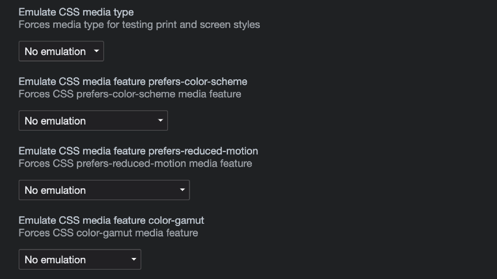

I wrote an article about [Simulating mobile devices in Chrome](/blog/simulating-mobile-devices-in-chrome/)
way back in 2016. I decided to extend it with this article where I cover different rendering options
that can be emulated from simple to extreme accessibility features.

Let's dive right in. Open the tools, go to **more tools** on the main shish-kebab menu
icon and click on **Rendering**. A new bottom split tab should open which should have options that look
like :point_down:


_An example of the contents in the Rendering tab which is displayed after you click on More tools > Rendering_

## Print vs Screen media

Scroll down to the **Emulate CSS media type** option and checkout the selectable options.
Changing the media type will force the selected media type so that you can test
between print and screen styles! This way you don't have to print preview each time.

:point_down: are examples of the media types in action

```css
@media print {
  ...;
}

@media screen {
  ...;
}
```

While you're at it, you can read the complete guide to CSS media queries
[article](https://css-tricks.com/a-complete-guide-to-css-media-queries/) from CSS-Tricks.

## Light vs Dark

If you have light and dark themes on your site you are most likely determining which one
to use by default based on OS/browser preference. This little override emulates the CSS media
feature `prefers-color-scheme` which forces the media type based on your selection: light or dark.

## Vestibular motion

Our vestibular system is key to controlling balance and eye movement.
People with vestibular disorders have the option to remove or replace the types
of motion-based animation that trigger discomfort which gets set in the
`prefers-reduced-motion` browser preference.

```css
/* Applies styles when Reduced Motion is enabled */
@media screen and (prefers-reduced-motion: reduce) {
}
```

Read an introduction to the Reduced Motion Media Query, an
[article](https://css-tricks.com/introduction-reduced-motion-media-query/) from CSS-Tricks.

Read another [article](https://blog.logrocket.com/new-in-chrome-74-prefers-reduced-motion-media-query-50cd89d3e769/),
this one is titled "New in Chrome 74: Prefers-reduced-motion media query", an article from LogRocket.

## Supported colors

Test the approximate range of colors that are supported by the **user agent** and the
output device. Read about the expanding gamut of color on the web, an
[article](https://css-tricks.com/the-expanding-gamut-of-color-on-the-web/) from CSS-Tricks.

## Vision deficiencies

[New](https://developer.chrome.com/blog/new-in-devtools-83/#vision-deficiencies) to
Chrome 83, the new **Emulate vision deficiencies** feature to gives a better idea of how
people with different types of vision deficiencies experience your site.

- Protanopia: the inability to perceive any red light.
- Deuteranopia: the inability to perceive any green light.
- Tritanopia: the inability to perceive any blue light.
- Achromatopsia: the inability to perceive any color except for shades of grey (extremely rare).

Read about simulating color vision deficiencies, an
[article](https://developer.chrome.com/blog/cvd/) from Chrome Developers.

## Summary

With just one tab, Chrome DevTools can help you emulate your web applications
from simple to extreme accessibility features. Keep an eye out for new features.
