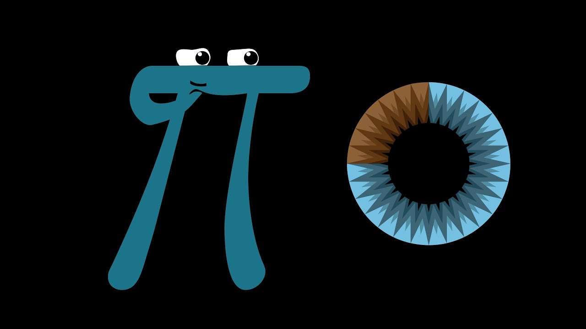

On a spontaneous and thrilling whim, I eagerly enrolled in the part-time Data Science boot camp at Le Wagon in Mauritius, commencing on June 24, 2023.
The journey kicked off with a rigorous 30-day prep phase before the official launch of the boot camp.
During this period, I delved into the realms of Linear Algebra, Statistics, and Calculus, subjects that I had never covered in such detail before.

The sheer complexity of these topics left me feeling disoriented and overwhelmed, prompting a wave of panic to set in.
However, I completed a 67-day, 360-hour immersive training experience that would redefine my understanding of data science.

Joining Batch #1287, I quickly found myself amidst a captivating journey that unfolded until its conclusion on December 9, 2023.
I have officially joined the ranks of Le Wagon's alumni, and I take great pride in having been a participant in the Data Science boot camp.

The boot camp proved to be an intensive yet immensely rewarding undertaking, thanks to the unwavering support of my peers, dedicated instructors, teaching assistants, campus staff, family and friends.

See my [public diploma](https://kitt.lewagon.com/schoolings/31498/public_diploma?token=62b1206b60a5f462154c32c8f5061ea4c758a0e96a99db368dd9fe86cacb39cc) at Le Wagon.

## Interested in joining?

1. **Embrace a Growth Mindset:** Approach the boot camp with a growth mindset, recognizing that challenges are opportunities to learn and improve. Stay open to new concepts, be persistent in the face of difficulties, and view the experience as a transformative journey that will enhance your skills and capabilities.

2. **Active Participation and Collaboration:** This is important for you and your group! Actively engage with the material, participate in discussions, and collaborate with your peers. Leverage the collective knowledge and diverse perspectives within the boot camp community. Working on group projects and seeking help when needed not only enhances your learning but also fosters a collaborative and supportive environment.

3. **Consistent Practice and Project Work:** Regularly practice coding and reinforce your understanding through hands-on projects. The more you immerse yourself in applying the concepts, the more confident and proficient you will become. Consider working on personal projects outside of the curriculum to solidify your skills and showcase your abilities to potential employers or collaborators.

## What did I learn?

I gained a profound understanding of the data science ecosystem, adopting essential tools and languages like Python, SQL, and machine learning frameworks.
Beyond technical skills, the program emphasizes problem-solving, fostering a mindset that empowers graduates to navigate the complexities of the ever-evolving data landscape with confidence and innovation.

### Back to Basics

Explore the fundamentals of Git which involves understanding version control and collaborative coding, enabling seamless collaboration and tracking changes in software development.
We delved into the Command Line interface which enhances proficiency in navigating and manipulating files and directories, providing essential skills for efficient code management and system interaction.

Do you know about `tree`, `history` and `grep`? Use `man` to find out more about these commands.

### Programming Languages

As an experienced software engineer, I am already familiar with the fundamentals of programming. I have had exposure to both Python and SQL but never in the context of data science.
It was a fun refresher and a great opportunity to learn new concepts and techniques.

- **Python** is the foundational programming language for data science in the boot camp and is used for data manipulation, analysis, and visualization while
- **SQL** is fundamental for working with databases and extracting valuable insights from structured data.
- [Juypter](https://jupyter.org/) Notebooks are a great way to experiment with code and visualize data quickly and efficiently.
- [Visual Studio Code](https://code.visualstudio.com/) has many extensions that can truly integrate your development experience.

### Statistical Concepts

- **Descriptive statistics** provide a compelling snapshot of data, revealing key insights through measures like mean, median, and standard deviation, allowing us to understand and summarize complex information.
- On the other hand, **inferential statistics** empower us to make predictions and draw meaningful conclusions about a population based on a sample, unlocking the ability to generalize findings and make informed decisions in various fields such as business, healthcare, and social sciences.

### Mathematics for Data Science

- **Linear Algebra** becomes indispensable when comprehending operations in high-dimensional spaces, a foundational concept crucial in machine learning.
- **Calculus**, specifically derivatives and integrals, plays a pivotal role in optimization algorithms, providing the mathematical framework essential for fine-tuning models and enhancing predictive accuracy.

### Machine Learning

- In **supervised** learning, models are trained on labeled data to undertake prediction or classification tasks.
- In **unsupervised** learning, the focus shifts to exploring patterns and relationships within data, even in the absence of labeled outcomes.
- **Model evaluation** is a critical phase, involving the assessment of machine learning models to gauge their performance and ensure their effectiveness in real-world applications.

### Data Analysis and Visualization

- **Pandas** and **NumPy** are Python libraries designed for efficient data manipulation and analysis, providing powerful tools for handling structured data.
- **Matplotlib** and **Seaborn** serve as essential tools in Python for crafting visualizations, enabling a more comprehensive understanding of data through the creation of insightful plots and graphics.

### Deep Learning

- **Neural Networks** form the fundamental building blocks of artificial intelligence, encompassing the basics crucial for delving into the realm of deep learning.
- **TensorFlow** and **Keras**, as frameworks, play pivotal roles in the construction and training of neural networks, providing powerful tools for implementing and optimizing sophisticated machine learning models.

### ML Ops

- **ML Ops** is a set of practices that combines machine learning and DevOps to enhance the efficiency of machine learning workflows, enabling the seamless deployment of models in production environments.
- **Docker** is a containerization platform that facilitates the packaging and deployment of applications, providing a standardized environment for running software in various environments.
- **Streamlit** is a Python library that enables the creation of interactive web apps for data science and machine learning, allowing data scientists to showcase their work and share their findings with the world.

### Soft Skills

- **Communication** skills are honed to effectively convey findings and insights, ensuring a seamless exchange of information within the data science domain.
- **Problem-solving** capabilities are sharpened, fostering critical thinking skills essential for addressing complex challenges inherent in data-related scenarios.
- The **art of presentation** is mastered, equipping individuals with the ability to articulate ideas and insights in a clear and concise manner, a valuable skill set for conveying complex information to diverse audiences.

### Real-World Projects

Hands-On projects by applying learned concepts to practical, real-world scenarios.
Collaborative coding where we were working on team projects to simulate real industry collaboration.

## Noteworthy!

- During the prep work, I enjoyed watching [StatQuest with Josh Starmer](https://www.youtube.com/channel/UCtYLUTtgS3k1Fg4y5tAhLbw).
  Josh focuses on simplifying complex statistical concepts and making them accessible to a broader audience through concise and engaging videos.
  Bam!

  Josh is a biologist with a passion for statistics and data science. His videos range from basic concepts to more advanced techniques, and are known for their clear visualizations and straightforward explanations.
  The goal is to help viewers, including students, researchers, and data enthusiasts, develop a better understanding of statistical principles in a fun and approachable manner.

- [3Blue1Brown](https://www.youtube.com/c/3blue1brown) is a popular YouTube channel and online educational platform created by Grant Sanderson.
  The channel focuses on providing high-quality, visually engaging explanations of complex mathematical concepts.
  Using animated visualizations and intuitive explanations, 3Blue1Brown aims to make advanced mathematical topics accessible and understandable to a broad audience.

  Grant Sanderson's content covers a wide range of subjects, including linear algebra, calculus, neural networks, and other advanced mathematical and scientific topics.
  The channel has gained widespread recognition for its innovative approach to teaching mathematics and has become a valuable resource for students, educators, and enthusiasts alike.

- [Kaggle](https://www.kaggle.com/) is a platform for predictive modeling and analytics competitions.
  It allows data scientists and machine learning practitioners to find and publish data sets, explore and build models in a web-based data-science environment, work with other data scientists and machine learning engineers, and enter competitions to solve data-related challenges.

  Kaggle has played a significant role in fostering a collaborative and competitive community of data scientists and machine learning practitioners. It's widely used by professionals, students, and researchers to apply and showcase their skills, learn from others, and tackle real-world data challenges.

- [Hugging Face](https://huggingface.co/) is an open-source platform that specializes in natural language processing (NLP) technologies.
  They are renowned for developing and maintaining the Transformers library, a popular open-source library for state-of-the-art natural language understanding (NLU) and generation (NLG) models.

  Hugging Face's platform also facilitates the sharing and collaboration of pre-trained models, making it a central hub for the NLP and machine learning communities to access, fine-tune, and deploy advanced language models.

- [Streamlit cloud](https://streamlit.io/) is a platform for deploying, managing, and sharing Streamlit apps.
  It allows data scientists and machine learning practitioners to build and deploy data apps in a matter of minutes, without the need for DevOps or IT support.
  It's also a great way to showcase your skills and build a portfolio of projects that you can share with potential employers.

## Who is Le Wagon?

Le Wagon, established in 2013 by Boris Paillard, Romain Paillard, and Sébastien Saunier, is at the forefront of providing individuals with the skills essential for success in the tech industry.
Through immersive boot camps, the organization not only prepares participants to secure jobs in the rapidly evolving tech sector but also nurtures the entrepreneurial spirit, enabling them to launch their own businesses.
With an extensive presence encompassing 45 campuses, Le Wagon has cultivated a thriving community of over 23,000 alumni, each equipped with the knowledge and tools to navigate the dynamic landscape of today's digital world.

The founders of Le Wagon embarked on this journey with a clear mission: to bridge the gap they perceived in traditional degree courses.
The result is a dynamic learning experience that empowers individuals to bring their ideas to life, filling the void left by conventional educational models.

Le Wagon's commitment to fostering innovation and adaptability is reflected in its curriculum, designed to meet the evolving demands of the tech landscape.
By prioritizing practical, hands-on learning, Le Wagon ensures that its participants not only grasp theoretical concepts but also gain the practical skills required to thrive in real-world scenarios.
As a result, the organization continues to be a catalyst for career transformations, entrepreneurial endeavors, and the cultivation of a globally connected community of tech-savvy individuals.

