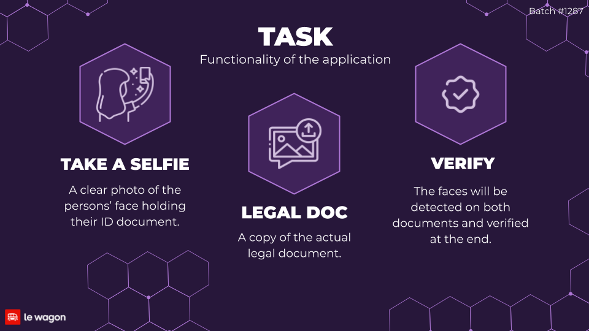
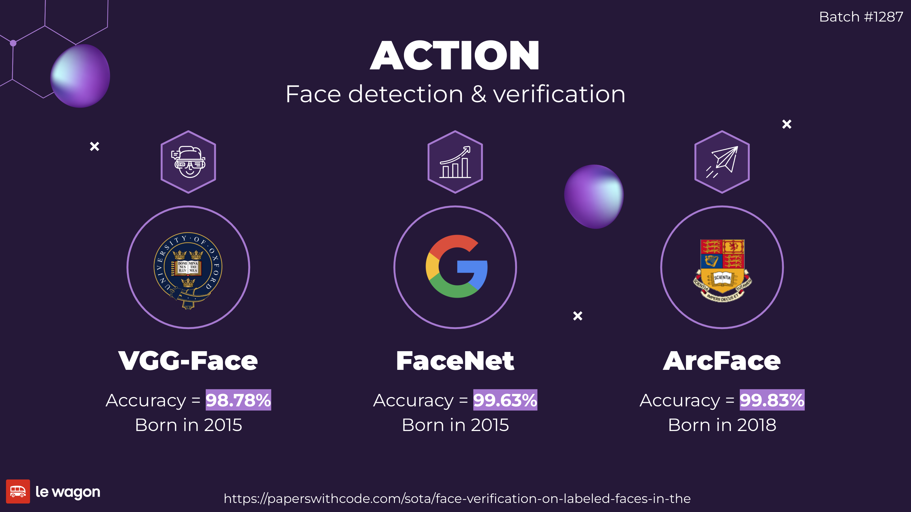
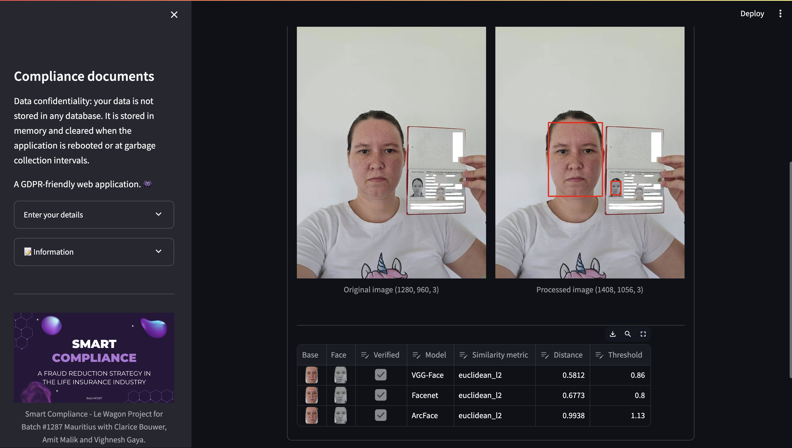
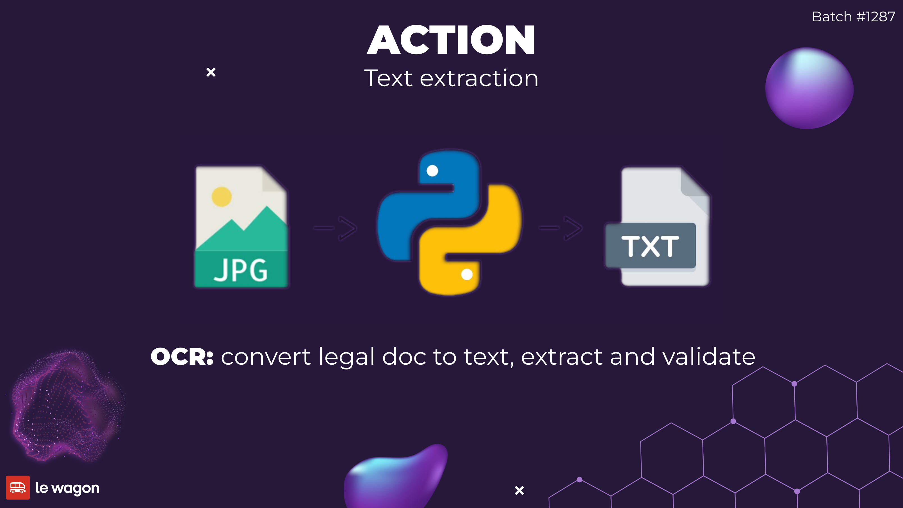
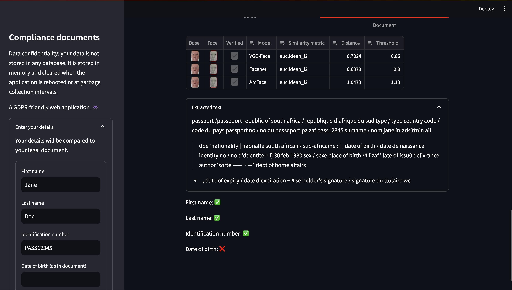
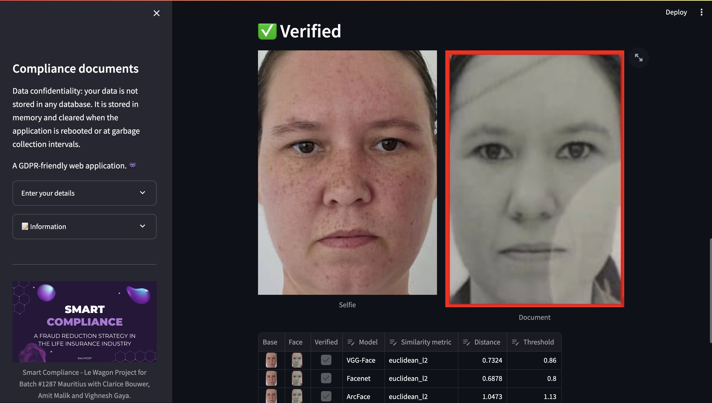

Presenting the Smart Compliance initiative—a strategic approach to combat fraud.
Allow the [Google Slides][Google Slides] to guide you through the journey that my team members, Amit Malik, Vighnesh Gaya, and I, undertook as a dedicated trio.
Our collaborative efforts culminated in the successful delivery of a proof of concept showcased during our demo day.

In the realm of life insurance, a pressing issue unfolds: the sale of policies to nonexistent individuals or those who never truly consented (cases of stolen identity) by brokers in the field.

Leveraging real data from a life insurance company affiliated with [Cloudsure Limited][Cloudsure], I uncovered a stark reality.
A staggering 14% of sales in the final quarter of 2022 were identified as fraudulent—translating to 900 documented cases within a mere four months.
Breaking it down further, that equates to approximately 225 cases per month.
Our presentation elucidates the consequential estimated revenue loss suffered by the company in the last financial year, a direct result of compromised sales integrity.

## Functionality of the application

Feel free to accompany the process by examining the [source code][Source Code] in :snake: Python.
To initiate the verification process, one would follow these steps in an online application form:

1. **Selfie**: Upload a clear photo in which the client holds their legal document (ID or passport) close to their face. Ensure that both the document and the face are prominently visible in the image.
2. **Legal document**: Provide a clear copy of the actual legal document.
3. **Verification**: The system will detect faces on both documents and conduct the verification process upon submission.

### Face detection and verification

We integrated three AI models for facial detection and verification from the DeepFace package:

- **VGG-Face**: Introduced in 2015 with an accuracy of 98.78%
- **Facenet**: Introduced in 2015 with an accuracy of 99.63%
- **ArcFace**: Introduced in 2018 with an impressive accuracy of 99.83%

The accuracy data is derived from the [Labeled Faces in the Wild][LWF_1] (LFW) dataset.

In the accompanying image, facial detection successfully identified my face in both the selfie and the passport, serving as my legal document.

During our exploration, we encountered challenges in facial verification, discovering that not all models consistently provided accurate results.
To address this, we opted for a composite approach, leveraging a combination of models.
After deliberation, we assigned weights to each model based on our understanding at the time each model constituted a percentage to the final score:

- **VGG-Face**: 10%
- **Facenet**: 40%
- **ArcFace**: 50%

Any score equal to or above 60% was deemed as a successful verification.
While the decision may seem arbitrary, it proved effective for our proof of concept.

#### Euclidean L2 distance

For the comparison of faces, various similarity metrics exist.
In our case, we opted for the Euclidean L2 distance due to its superior performance, considering the constraints of our application, which was already quite resource-intensive.

Imagine you have two points on a piece of graph paper, like two dots.
The Euclidean L2 distance is like the straight-line measurement between these dots.
It's like finding the shortest path to walk from one dot to the other, even if you need to take a few steps both horizontally and vertically.
So, when we compare faces using Euclidean L2 distance, we're essentially measuring how far apart they are in a straight line on an imaginary graph.

The accuracy of Euclidean L2 distance in comparing faces lies in its ability to measure the direct or "as-the-crow-flies" distance between key features of the faces.
By considering the overall spatial arrangement of facial features, such as eyes, nose, and mouth, it captures the geometric relationships effectively.
This method is robust because it accounts for both horizontal and vertical differences, providing a reliable measure of similarity or dissimilarity between faces based on their spatial structure.

In simpler terms, it helps us understand how close or far apart the features are in a straightforward manner, contributing to accurate face comparisons.

### Optical Character Recognition (OCR)

As an additional layer of security, we contemplated utilizing Optical Character Recognition (OCR) to extract text from the legal document and cross-reference it with the information entered by the user into the system.
Although we intended to use a more robust smart OCR solution, time constraints led us to adopt a straightforward approach using regular expressions.

We employed pytesseract to extract raw text from the legal document and the regular expressions to identify and compare key details such as the first name, last name, identification number, and date of birth.
The system then marked these fields as either found (✅) or not found (❌) based on the comparison results.
It did not constitute to a pass or fail of the verification process as initially planned.

#### Tesseract

Tesseract is an OCR engine which works by analyzing images to identify and extract text.
It processes the input image through a series of advanced algorithms, recognizing patterns and shapes to discern characters.
Utilizing machine learning and neural networks, Tesseract adapts and learns to recognize different fonts, languages, and textual structures, making it a versatile tool for converting image-based text into machine-readable formats.

We used Pytesseract, a Python wrapper for Tesseract.
It let us easily integrate Tesseract's functionality into our Python application.
Pytesseract simplifies the process of interacting with Tesseract by providing a convenient interface to execute OCR operations within Python scripts.

#### Regular expressions

Regular expressions, or regex, are a sequence of characters that define a search pattern.
They are used to identify and extract specific information from a larger body of text.
It is a powerful tool, allowing us to search for specific characters, words, or patterns, and even replace them with other characters or words.
We used regular expressions to extract key details from the legal document, such as the first name, last name, identification number, and date of birth and match them against the user-entered information.

### Verification

The verification process involved the use of three facial detection and verification models—VGG-Face, Facenet, and ArcFace—weighted based on their individual strengths.
These models were applied to a selfie and legal document, with scores aggregated for a final verification decision.
Additionally, a rudimentary OCR solution was considered, using pytesseract and regular expressions to compare user-entered details with extracted text from the legal document.
This approach was intended to be taken into account for the final verification decision.

## Improvements

Looking back, in light of [Streamlit][Streamlit Cloud] crashing due to excessive memory consumption (sorry Streamlit Cloud), adopting an API hosted on Google Cloud would have been a prudent choice.
Our ideal setup would have involved a lightweight Streamlit application solely serving as the front end to the API.

Given additional time, we aimed to delve deeper into the intricacies of the models, fine-tuning optimal weights and exploring advanced similarity metrics for enhanced face verification accuracy.
We envisioned refining the verification process for smarter outcomes and integrating a more robust Optical Character Recognition (OCR) solution to handle data extraction with greater efficiency.

## My experience

Working on this project was like training our facial recognition skills—sometimes we were on point, and other times we felt like our computers were giving us the "404: Face Not Found" error.
But hey, just like good teamwork, a good laugh is essential, and we're grateful for the moments when debugging became a group therapy session! :rofl:

Embarking on this project was an enriching experience, offering us valuable insights into facial detection, verification, and OCR.
Beyond the technical aspects, we gained profound lessons in teamwork, emphasizing the significance of communication and collaboration.

### Key takeaways

1. **Facial Recognition and Verification:** Explored the implementation of three AI models for facial detection and verification (VGG-Face, Facenet, ArcFace), emphasizing the importance of combining models for more reliable results.

2. **System Architecture Considerations:** Recognized the significance of system architecture, contemplating the shift to an API hosted on Google Cloud for improved efficiency and reduced memory consumption, especially in the context of Streamlit limitations.

3. **Teamwork and Collaboration:** Acknowledged the vital role of teamwork, communication, and collaboration in project success.
   Recognized and appreciated team members for their contributions, adapting to challenges, and showcasing flexibility, ultimately leading to a successful demo day presentation.

4. **Time**: The team prioritized practical solutions and streamlined the verification process to optimize productivity within the project's time frame.
   Recognizing the significance of everyone's time, it should be regarded as a precious commodity.

## Acknowledgments

A special shout-out goes to Amit for delivering an outstanding contribution and presentation on demo day, stepping in seamlessly when I couldn't.
Gratitude also extends to Vighnesh for his commendable participation and contributions within the constraints of his time.
Thanks to the Le Wagon team for their unwavering support and guidance throughout the boot camp.
Lastly, heartfelt appreciation to my family, friends, and colleagues for their steadfast support and encouragement during moments when frustration threatened to take over and I wanted to pull my hair out.

## Conclusion

In this article we discussed the development of the Smart Compliance project, focusing on fraud reduction in life insurance.
The team implemented three facial detection and verification models and considered an OCR solution for additional security.
Despite challenges, including memory issues with Streamlit, the project fostered valuable learning experiences in teamwork, model optimization, and the importance of communication and support.

## References

- [Source Code][Source Code]
- [Google Slides][Google Slides]
- [Cloudsure Limited][Cloudsure]
- [Labeled Faces in the Wild][LWF_1] (LFW) dataset by the [University of Massachusetts][LWF_2], Amherst
- [Streamlit Cloud][Streamlit Cloud]

[Source Code]: https://github.com/cbillowes/smart-compliance
[Google Slides]: https://docs.google.com/presentation/d/15EKHnaQ7YhQpt4eq3izoLYP2lkwKclwBPkZg00silDI/edit?usp=sharing
[Cloudsure]: https://www.cloudsure.mu
[LWF_1]: https://paperswithcode.com/sota/face-verification-on-labeled-faces-in-the
[LWF_2]: https://vis-www.cs.umass.edu/lfw/
[Streamlit Cloud]: https://streamlit.io/
