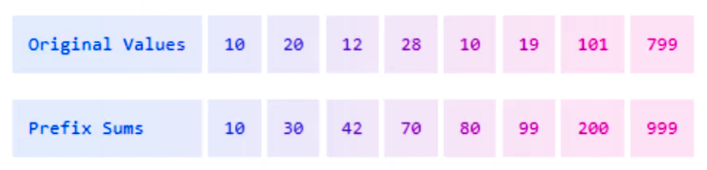

> **TL;DR:** By using a Prefix Sum Array, you can efficiently calculate the sum of any sub-array in constant time after an initial linear-time setup. It's a simple yet powerful technique that can optimize your code and save computational resources.

`youtube:https://www.youtube.com/embed/g0z2L0bJ6xM`

Once upon a time in the land of Arrays, there lived a young programmer named Alex. Alex was on a quest to find the most efficient way to calculate the sum of various sub-arrays.

Little did Alex know, an ancient technique known as the **Prefix Sum Array** was about to become his trusty companion.

What Alex is trying to do is find the total sum of elements within a specific range of indices in an array. A sub-array is a contiguous sequence of elements within the original array, defined by a starting index `i` and an ending index `j`, where `i ≤ j`.

> “Given an array of numbers, create a second array where each element stores a running total calculated from adding the corresponding element in the first array.”

This is a popular programming puzzle used to test the array handling skills of software developers among other practical use cases I share below.



## Brute Loops of Despair

Alex started by tackling the problem head-on, using the most straightforward method possible: **brute force**.

_"For every sum I need,"_ Alex thought, _"I'll just loop through the elements and add them up."_

After writing code that looked something like this:

```javascript
function rangeSum(arr, start, end) {
  let total = 0;
  for (let i = start; i <= end; i++) {
    total += arr[i];
  }
  return total;
}
```

### Explanation

- **Function Definition**: We define a function named `rangeSum` that takes an array arr, a starting index start, and an ending index end as parameters.
- **Initialization**: We initialize a variable total to `0` to keep track of the sum.
- **Loop**: We use a for loop starting from `i = start` and continue as long as `i <= end`, incrementing `i` by `1` each time.
- **Accumulation**: Inside the loop, we add the value of `arr[i]` to total.
- **Return Value**: After the loop ends, we return the `total`, which is the sum of the elements from index start to end, inclusive.

```javascript
const arr = [5, 3, 8, 6, 2];
const sum = rangeSum(arr, 1, 3); // Sums elements at indices 1 to 3
console.log(sum); // Output: 17
```

Alex ran the program. It worked—for small arrays.

But as the array grew larger and the number of queries increased, the program slowed to a crawl. It was as if Alex was trying to fill a bathtub with a teaspoon.

_"There must be a better way,"_ Alex sighed, staring into the abyss of the loops.

---

So, this approach to calculating range sums, where each query iterates through the specified range, quickly becomes inefficient for large arrays or multiple queries, as each call has linear time complexity based on the range size. Repeating calculations for overlapping ranges wastes resources, making it unsuitable for performance-critical or real-time applications where low latency is needed. Additionally, it lacks preprocessing optimizations like prefix sums, which could allow constant-time queries. This method also doesn’t handle dynamic data well, as each change in the array requires a full recalculation. Overall, while straightforward, this approach struggles with scalability and efficiency in demanding scenarios..

---

## A Shift in Perspective

Just as despair was setting in, a senior developer named Sam walked by. _"You look like someone who’s just discovered a bug on a Friday afternoon,"_ Sam remarked.

_"I’m trying to efficiently calculate the sum of multiple sub-arrays, but my current method is slower than a snail running a marathon,"_ Alex replied.

Sam chuckled. _"Have you heard of the Prefix Sum Array?"_

Alex shook his head. _"Is that some kind of new coffee blend?"_

Sam: _"No, but it might just be the caffeine boost your code needs."_

## Applying the Algorithm

Sam explained, _"A Prefix Sum Array is an array that contains the cumulative sums of another array. Once you have it, you can calculate the sum of any sub-array in constant time."_

_"Show me this sorcery!"_ Alex exclaimed.

Sam: _"Alright, let's take a simple array:"_

```text

Index:  [0   1   2   3   4]
Value:  [2,  4,  6,  8, 10]
Result: [2,  6, 12, 20, 30]
```

Same continues, _"we build the Prefix Sum Array by accumulating the sums:"_

- **Prefix[0] = Original[0] = 2**
- **Prefix[1] = Prefix[0] + Original[1] = 2 + 4 = 6**
- **Prefix[2] = Prefix[1] + Original[2] = 6 + 6 = 12**
- **Prefix[3] = Prefix[2] + Original[3] = 12 + 8 = 20**
- **Prefix[4] = Prefix[3] + Original[4] = 20 + 10 = 30**

_"Now,"_ Sam continued, _"to find the sum of a sub-array from index `i` to `j`, you can use the formula:"_

- **If `i` is 0:** `Sum = Prefix[j]`
- **Else:** `Sum = Prefix[j] - Prefix[i - 1]`

Sam said, _"let's find the sum from index 1 to 3."_

- **Sum = Prefix[3] - Prefix[0] = 20 - 2 = 18**

Then, _"And if we check manually: 4 + 6 + 8 = 18. Voila!"_

Alex's eyes widened. _"That's brilliant! It's like having a calculator that only needs to think once."_

## Implementing the Magic

Eager to try this out, Alex wrote the code:

```javascript

function buildPrefixSum(arr) {
    const prefix = Array(arr.length).fill(0);
    prefix[0] = arr[0];
    for (let i = 1; i < arr.length; i++) {
        prefix[i] = prefix[i - 1] + arr[i];
    }
    return prefix;
}

function rangeSum(prefix, start, end) {
    if (start === 0) {
        return prefix[end];
    } else {
        return prefix[end] - prefix[start - 1];
    }
}

// Example usage:
const arr = [2, 4, 6, 8, 10];
const prefix = buildPrefixSum(arr);
console.log(rangeSum(prefix, 1, 3));  // Output: 18
```

Running the code, Alex confirmed that the function returned the correct sums almost instantly, even for large arrays.

_"This is going to save me so much time—not to mention my CPU's sanity,"_ Alex mused.

To solidify the understanding, Alex decided to create a visual representation.

### Original Array vs. Prefix Sum Array

| Index | Original Array | Prefix Sum Array |
| ----- | -------------- | ---------------- |
| 0     | 2              | 2                |
| 1     | 4              | 6                |
| 2     | 6              | 12               |
| 3     | 8              | 20               |
| 4     | 10             | 30               |

_"Seeing it laid out like this,"_ Alex thought, _"makes it as clear as code on a whiteboard."_

Feeling accomplished, Alex couldn't resist adding a touch of dry humor to the documentation:

_"Using brute force to calculate sub-array sums is like reinventing the wheel every time you need to drive somewhere. The Prefix Sum Array hands you the keys to a car—why walk when you can ride?"_ Alex chuckled at the analogy.

## The Moral of the Story

The journey taught Alex that sometimes, the solutions to our most perplexing problems are hidden in plain sight—nested not in complex algorithms, but in simple, efficient patterns.

_"In programming, as in life, accumulating wisdom saves time in the long run,"_ Alex concluded, satisfied with the quest's outcome.

### Complexities

It is important to note that the prefix sum array approach has a time complexity of `(O(n + q))`, where `(O(n))` is required to build the prefix sum array by making a single pass through the original array, and `(O(q))` is for answering `(q)` range sum queries, each in constant time `(O(1))` due to simple lookup operations. The space complexity is `(O(n))`, as an additional array of size `(n)` is needed to store the prefix sums. This approach is efficient for scenarios with frequent range sum queries on static data, as the preprocessing step is linear, and queries are answered in constant time.

## Practical Applications

### **Efficient Range Sum Queries in Financial Analysis**

Suppose you're analyzing the daily sales of a retail store over a year, stored in an array where each element represents the sales on a particular day:

```plaintext
Daily Sales: [1500, 2300, 1800, 2200, 1700, ...]  // up to 365 days
```

If you need to calculate the total sales between day 50 and day 200 multiple times, summing these values repeatedly is inefficient. By creating a prefix sum array, where each element at index `i` contains the total sales from day 1 up to day `i`, you can compute the total sales for any range instantly using the formula:

```plaintext
Total Sales (Day i to Day j) = PrefixSum[j] - PrefixSum[i - 1]
```

This method significantly speeds up financial analysis, allowing quick calculations of total sales over any period without redundant computations.

### **Accelerating Image Processing with 2D Prefix Sums**

In image processing, tasks like calculating the sum of pixel values within a specific rectangular region are common—for example, when applying filters or detecting features. Represent the image as a 2D array where each element is a pixel's intensity. By constructing a 2D prefix sum array (also known as an integral image), where each cell contains the sum of all pixels above and to the left of it, you can compute the sum of any rectangular region in constant time:

```plaintext
Region Sum = PrefixSum[x2][y2] - PrefixSum[x1 - 1][y2] - PrefixSum[x2][y1 - 1] + PrefixSum[x1 - 1][y1 - 1]
```

This approach dramatically improves the efficiency of image processing algorithms, making real-time image analysis and manipulation feasible.

### **Efficient Event Counting in Web Analytics**

In web analytics, tracking user interactions such as page views, clicks, or transactions over time is crucial. Suppose you have an array where each element represents the number of user events on your website for each day of the year:

```plaintext
Daily Events: [1200, 1350, 1100, 1500, 1600, ...]  // up to 365 days
```

If you want to analyze user engagement between any two dates frequently—for instance, to compare week-over-week performance—calculating the total events for each date range individually would be inefficient. By constructing a prefix sum array where each element at index `i` represents the total events from day 1 up to day `i`, you can quickly compute the total events between any two days using the formula:

```plaintext
Total Events (Day i to Day j) = PrefixSum[j] - PrefixSum[i - 1]
```

This method allows for rapid analysis of user engagement over any period, facilitating timely marketing strategies and user behavior insights.

### **Calculating Cumulative Grades in Education**

In an academic setting, instructors often need to compute cumulative grades for students to assess their progress throughout a course. Imagine an array where each element represents the score a student received on consecutive assignments:

```plaintext
Assignment Scores: [85, 90, 78, 92, 88, ...]  // for multiple assignments
```

To find a student's total score between any two assignments, you can create a prefix sum array. Each element at index `i` in this array will represent the total points earned from the first assignment up to assignment `i`. Using the prefix sum array, you can efficiently calculate the cumulative score for any range of assignments:

```plaintext
Total Score (Assignment i to Assignment j) = PrefixSum[j] - PrefixSum[i - 1]
```

This enables educators to quickly determine grades for progress reports or to identify periods where a student may need additional support.

### **Traffic Analysis in Network Monitoring**

Network administrators need to monitor data traffic to manage bandwidth and detect unusual activity. Suppose you have an array where each element represents the amount of data (in gigabytes) transferred each hour:

```plaintext
Hourly Data Transfer: [2.5, 3.0, 2.8, 3.5, 4.0, ...]  // over 24 hours
```

To assess the total data transferred during any time interval—say, during peak hours—you can use a prefix sum array. By calculating the cumulative data transfer up to each hour, you can quickly determine the total data transmitted between any two hours using:

```plaintext
Total Data (Hour i to Hour j) = PrefixSum[j] - PrefixSum[i - 1]
```

This approach allows for efficient analysis of network usage patterns, helping administrators optimize resource allocation and identify potential security issues promptly.

---

These practical examples illustrate how prefix sum arrays can significantly enhance efficiency in various fields by enabling rapid calculations of cumulative data over specified ranges.

## References

- [Wikipedia](https://en.wikipedia.org/wiki/Prefix_sum)
- [LeetCode](https://leetcode.com/problem-list/prefix-sum/)
- [CodeChef](https://www.codechef.com/practice/prefix-sums)
- [USACO Guide](https://usaco.guide/silver/prefix-sums?lang=cpp)
