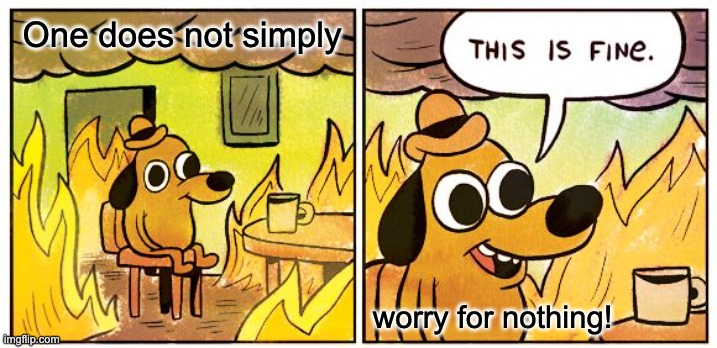

Worry makes you do stupid things. Perhaps you suffer from insomnia, bite your nails or lips, eat too much, or not eat enough. If you let it linger, consume and debilitate you, you could actually get seriously ill.

> "Those who do not know how to fight worry die young." Dr Alexis Carrel, a French surgeon and biologist.

Read the quote above again. This is a critical statement. Let it simmer and sink in. Worry is lethal.

We fear the unknown. It's unsettling. We are unprepared. When it consumes us, it paralyzes the brain so that we can't think. As leaders, this is a dangerous place to be. In this article, we will explore worry, its challenges, and a few ways we can tackle it.

The most important formula we will touch on is the 'magic formula,' developed by [Willis H. Carrier](https://en.wikipedia.org/wiki/Willis_Carrier), an American engineer who invented modern air conditioning. The formula is simple:

1. Ask yourself "what is the worst thing that could possibly happen?"
1. Prepare to accept it—if necessary.
1. Calmly work to improve the situation.

## The Purpose of Worry

We need to know when to address potential threats. Anticipate, plan, prepare, and avoid risks. This is the purpose of worry. It's a critical survival instinct that _encourages_ us to take action. But in the modern world, worry is becoming counterproductive due to its sheer volume and intensity. It's crippling the brain's ability to think clearly.

> **Tip**: Worry is a critical survival instinct that encourages us to take action. Acknowledge it when it pops up.

## The Roots of Worry

There are varying reasons why one would worry. [Maslow's Hierarchy of Needs](https://www.tsw.co.uk/blog/leadership-and-management/maslows-hierarchy-of-needs/) is a psychological framework that categorizes human needs into five levels: physiological, safety, social, esteem, and self-actualization. The impact becomes more powerful the closer the worry is to the bottom of this triangle. This is because challenging basic needs leads to a life-threatening situations.

Exploring Malsow's model is beyond the scope of this article. What's important is to know that there are varying reasons and levels for worry. The key is to identify the root cause of your worry and address it.

### Worry is Relentless

I've noticed something surprising: I worry more the older I get. I worry when I leave the house, imagining someone breaking in to steal valuable items like documents or laptops. I hide my handbag with cards in the car to avoid being pick-pocketed, but then I worry about the car being stolen or broken into. I worry about traveling—fearing kidnapping, hijacking, or injury. I worry that I’ll choke, drown, or fall. I worry about pain, suffering, and death. I worry about the future (not ready to retire), the past (not having done enough), the present (I am missing out). Sometimes, I even worry about the fact that I worry. It's a vicious cycle and is getting harder to deal with.

It plagues my professional life too. I worry about making mistakes, missing deadlines, not being good enough. What if I can't deliver? Am I leading and managing effectively? Perhaps I am not able to mentor, learn, or grow effectively. I worry about not being able to innovate and not being able to think.

Worry is relentless because of the persistent, painful, powerful mental loops it creates. Uncertainty brews and it makes fear feel bigger which only exacerbates the problem.

I don't succumb to the worry anymore. It's there but I manage it, sometimes better than other times. I don't brew on them, and I always take action, even if it's delayed. I attend to the trigger or cause of the worry and prepare or take precautionary measures. I know that I need a clean mind to think and can't do so if the worry eats away at me.

> **Tip**: Acknowledge it's existence and use the triggers as an opportunity to prepare or take precautions, but don't get crippled by the actuality of it.

### Worry is a Waste of Time

I bolt upright in my bed, my heart is thudding in my chest. The room is dark but slightly pierced by the streetlight from outside. The air is hot and humid and sweat trickles down my forehead from stress. My eyes slowly adjust to the dim surroundings. I glance at the bedside clock. It's 3:42 AM and I'm wide awake. The worries from the day before now wash over me, haunting my mind like ghosts at the witching hour. I'm awake and sleep feels unreachable—a distant dream.

> **Tip**: Address the root cause of your major worries before going to bed so that you can sleep better.

Worry can disrupt your life—keeping you up, exhausting your mind, and leaving you anxious. For instance, imagine lying in bed, replaying the day’s mistakes or imagining disasters that may never happen, leaving you unable to relax or fall asleep. Sleep is crucial for mental health and critical thinking.

How much time have people lost while worrying instead of sleeping? Here's a [research paper](https://www.sciencedirect.com/science/article/pii/S2666915321000615) about worry and sleep. The findings suggest that higher levels of worry are associated with poorer mental health outcomes and negative health behaviors, highlighting the need for targeted interventions to address worry in this population.

### Worry Can Be Imaginary

It was a Saturday morning. I went for a walk in the forest with my energetic dog, a Yorkshire Terrier. As we walked peacefully along the path, the sun tickled my neck with its warm rays, the wind slowly rustled leaves high above, tree-tops slow-danced while birds sang their sweetest songs. My dog was running in front curiously exploring the unknown path. I was looking down to make sure I didn't step on anything when suddenly, a branch snapped from high above and fell towards us with such force that it impaled...I snap out of it and come back to reality as I continue to walk. The freak accident wasn't real. The figment of my imagination was so vivid that it left me startled.

This doesn't mean that I will never get impaled by a branch but the chances are so small that it's not worth the worry price tag attached with it. **Living life in constant fear of things that can go wrong will rob you of the things that can go right!**

Taking a stab at the professional world could be a similar experience. The constant worry about things that can go wrong like a project failing, your team not delivering, the client being unhappy, the boss being dissatisfied, the company going bankrupt. The list is endless. The worry is real but unprecedented.

Every time something figment of my imagination throws a flash-bang of worry at me, I breath. A deep, relaxing, revitalizing breath. Again, I acknowledge the moment and the significance of the trigger but I let it go because it is not happening to me right now. I am safe. This gives me the calmness to consider it's roots and address it. Overthinking and lingering on the thought will make it worse because you won't be able to think clearly.

> **Tip**: Take a deep breath! Let the moment come and then let it go. Assess your safety. If you are in immediate danger, act immediately. If not, take a moment to calm down and gather your thoughts.

### Worry Can Lead to Burnout

I've had pockets of burnout in my career. I used to wear worry as a uniform for being a responsible adult and a professional software engineer. It burnt me to a crisp. Life is seriously too short to worry about things beyond your control.

Are you working long hours, chasing unrealistic deadlines? Are you nervous about the AI hype and that your skills might be replaced by the machine. Do you work solid hours without taking breaks or taking a step back to breathe?

For the last 6 months of 2024, the team have been grinding, hard. We initially chased a dream to build out new products but had to pivot to chase a critical deadline instead. The work was intense and the pressure was high. It's important to know that when one person leaves a team, the morale of the team drops. We had a bit of churn which the team didn't get time to recover from. During the 6 months, we were down a few more players and the team was stretched thin. There is ambiguity in roles, expectations aren't always clear and the team is not always aligned. The burn out was inevitable and real.

I managed to steer clear from this horror because I've seen this before. I put in more effort this year than in my whole career and left the year exhausted yet satisfied and healthy. How did I do it? Admittedly there was worry and frustration but **I acted on it** every time. I became the **keeper of my own destiny**.

> **Tip**: Slow down! Take regular breaks. Eat well, exercise, and get good sleep.

## How To Address Worry

There’s a wealth of knowledge in the written words of others—talks, experiences, and stories shared online or in books. The information is readily available; we just need to consume it and **act on it**.

So, I picked up a practical handbook by [Dale Carnegie](https://en.wikipedia.org/wiki/Dale_Carnegie): _How to Stop Worrying and Start Living_. The book practically jumped at me in the bookstore! Though I’d heard of him, I’d never read his books before. Three titles caught my eye, but this one stood out most, and I’m starting my journey here. I'm only a chapter in but my blood is pumping and I'm itching to write about it.

> **Did you know?** Carnegie spent seven years researching and interviewing experts to create this book.

### Be Mindful

[Sir William Osler](https://en.wikipedia.org/wiki/William_Osler), a prominent physician and co-founder of Johns Hopkins Hospital, introduced the concept of "day-tight compartments." Osler compared our lives to a ship equipped with water-tight compartments. To prevent flooding from spreading through the vessel, the ship's crew can seal off compartments, keeping each section isolated.

Applying this concept to life, we can focus exclusively on the present day—closing off "compartments" of the past (regret, guilt) and the future (fear, anxiety). By doing so, we conserve energy and direct our attention to what we can control right now. This can reduce the overwhelming burden of worrying about things beyond our control.

> **Tip**: Live in the present. Let thoughts ebb and flow. If you find yourself worrying about the past or future, gently guide your mind back to the present moment.

So what about the past and the future? Do I simply write them off? No. Make time for reflection and planning, but don't let these moments consume you. The past is a teacher, the future a journey. The present is where you live.

> **Did you know?** If you find yourself worrying less or not worrying at all, then you find that your brain is more free to think, create, plan and innovate. You are more productive and efficient this way.

### Prepare for the Worst

Short of a decade ago at MultiChoice, a mentor of mine looked at me carefully and asked me "what's the worst that could happen?" The contorted look on my face was an indication that the gears in my brain were turning at a rapid pace while I thought. I was encouraged to extract about three worst-case scenarios to the situation, assess them and then highlight those potential outcomes so that I can prepare for them.

> **Did you know?** This question distills the fear by breaking the vague or unknown into manageable estimated outcomes.

By naming the worst - that you can think of - you often realize it's less catastrophic than your imagination initially suggested. This new sense of clarity can help you plan to address the situation or mitigate its impact. Mental preparation can make you more resilient. And if the scenario is too big, you can ask this question recursively until you have smaller, manageable chunks to work with.

This brings us back to the Willis H. Carrier formula which is outlined by the following steps:

1. Ask yourself what's the worst that could possibly happen.
1. Prepare to accept it if you have to.
1. Calmly proceed to improve the situation.

It was little surprise that this formula was in the book because it makes so much sense to me. Once you have the worst-case scenarios, start preparing for them as though they are absolutely certain to happen. This will help you to be more prepared and less anxious about the situation and anything else that happens could be less of a shock to your system.

> **Tip**: Mental preparation can make you more resilient. Ask yourself what's the worst that could possibly happen, prepare to accept it if you have to, and calmly proceed to improve the situation.

### Counterbalance With Gratitude

There is a lot of pretty messed up stuff happening in this world right now with war, crime, climate change, storms, hate, murder, social media, bullying and more. Worry is a household name or companion of sorts. When dealing with fickle worries, after we have chunked them into bite-sized manageable pieces, we can now focus on some good to counterbalance the situation.

A popular means of practicing gratitude is through **journaling**. Practice to be as specific as possible like writing "the warmth of the sun during my walk in the forest" instead of "good outdoor weather" because it deepens your awareness and enhances the emotional impact of the practice. It also strengthens your memory as detailed entries reinforce positive memories, making them more accessible during difficult times.

Another practice is **verbal appreciation** where you say "thank you" out loud to acknowledge efforts of yours or others or **mindful reflection** which involves pausing for a moment before meals, bedtime or some activities, to mentally list things you appreciate about the given moment.

- [Journaling to Cope With Anxiety](https://www.verywellmind.com/journaling-a-great-tool-for-coping-with-anxiety-3144672) - verywellmind.com
- [What is a Worry Journal for Stress](https://www.healthline.com/health/stress/can-a-worry-journal-help-you-manage-stress) - healthline.com

> **Tip**: Practice gratitude through journaling, verbal appreciation, or mindful reflection to counterbalance worry.

## Conclusion

Worry can be ruthless and relentless, consuming our thoughts and energy, leaving us paralyzed by fear and anxiety so we can't think. But it doesn’t have to be this way. Through intentional practices like living in "day-tight compartments," or mindfully in the moment, asking ourselves "What's the worst that could happen?" and balancing worry with gratitude, we can regain control over our thoughts and emotions so that we can truly think, plan and act!

> "Face the facts: Quit worrying; then do something about it!" Olga K. Jarvey's doctor's advice to her.

I'm no worry-combat expert but I do find this topic serious enough to act on it.

## Summary

- **Acknowledge**: Worry is a critical survival instinct that encourages us to take action. Acknowledge it when it pops up.

- **Plan & Prepare**: Use the trigger of worry as an opportunity to prepare or take precautions.

- **Get Proper Sleep**: Address the root cause of your major worries before going to bed so that you can sleep better.

- **Snap Out of It**: Take a deep breath! Let the moment come and then let it go. Assess your safety. If you are in immediate danger, act immediately. If not, take a moment to calm down and gather your thoughts.

- **Slow Down**: Take regular breaks. Eat well, exercise, and get good sleep.

- **Be Mindful**: Live in the present. Let thoughts ebb and flow. If you find yourself worrying about the past or future, gently guide your mind back to the present moment.

- **Plan for the Worst**: Mental preparation can make you more resilient. Ask yourself what's the worst that could possibly happen, prepare to accept it if you have to, and calmly proceed to improve the situation.

- **Practice Gratitude**: Practice gratitude through journaling, verbal appreciation, or mindful reflection to counterbalance worry.

- **Stop It!**: "Those who do not know how to fight worry die young." Face the facts: Quit worrying; then do something about it!

## References

- [How to Stop Worrying and Start Living: Time-Tested Methods for Conquering Worry](https://www.goodreads.com/book/show/4866.How_to_Stop_Worrying_and_Start_Living), a book by Dale Carnegie on Goodreads
- [Can You Die from Stress? It May Depend on How You Manage It](https://psychcentral.com/stress/can-you-die-from-stress), an article by Morgan Mandriota on April 25, 2022 on PsychCentral
- [Affect, worry, and sleep: Between- and within-subject associations in a diary study](https://www.sciencedirect.com/science/article/pii/S2666915321000615) Research Paper by ScienceDirect by A Narmandakh, A.J. Oldehinkel, M Masselink, P de Jonge, A.M. Roest b
- [Journaling to Cope With Anxiety](https://www.verywellmind.com/journaling-a-great-tool-for-coping-with-anxiety-3144672) - verywellmind.com
- [What is a Worry Journal for Stress](https://www.healthline.com/health/stress/can-a-worry-journal-help-you-manage-stress) - healthline.com
