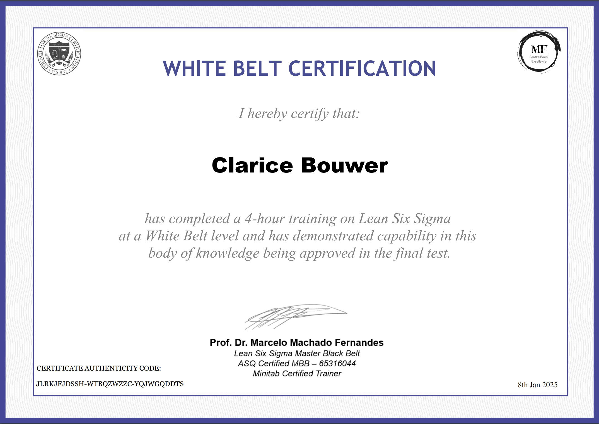

Do you see the light at the end of your backlog?
Do you know where to start prioritizing?
Is your process working for you?

What about compounding technical debt? Regression rates? How long does it take to develop features from start to finish? Do you even know what “done” means in your team?

Are you overwhelmed or burning out?
Do you have the right skills for the job?
Is there a shared understanding of goals across your team and the business?

And finally, can you spot inconsistencies, workload waste, inefficiencies, and unpredictability in your process?

Woah. That’s a lot of questions. But here’s the thing: if you’ve ever felt stuck in the never-ending grind of feature delivery, these questions are the key to unlocking where things might be going wrong. They help you zoom out, reflect, and figure out where the bottlenecks, inefficiencies, or frustrations are coming from. Waste is everywhere and it costs money. Waste can be in the form of waiting (dependencies), overproduction (gold-plating), defects (bugs), underutilized talent (working on the wrong things or context switching), unfinished work (wip) and so forth.

Without asking these questions, you might be stuck solving the wrong problems—or worse, not solving them at all. Answering them is the first step toward building a process that’s clear, predictable, and (dare I say it) enjoyable.

> Peter Drucker put it best:
> “If you can't measure it, you can't improve it.”

And he’s right—because if you don’t measure the impact of changes in your process, how will you ever know if things are actually getting better? Without quantifiable data, you can't track progress. Now, that’s where my angle of Lean Six Sigma (LSS) comes in.

## Lean Six Sigma (LSS)

LSS is a data-driven methodology for solving chronic, complex problems. By focusing on reducing waste and variation, it helps teams deliver tangible value to customers and businesses. I’m proud to be White Belt certified and eager to keep learning. A big thanks goes to [Dr Marcelo Machado Fernandes](https://www.linkedin.com/in/marcelo-machado-fernandes-2a053322) and his excellent work at MF Treinamentos.

> “Pull a thread here and you’ll find it’s attached to the rest of the world.” - Nadeem Aslam

Software systems can be complex, intricate and interconnected, especially distributed ones. Touch this module and the app goes down. Move this code and the module overflows its stack. Tweak this UI and the user experience is ruined. Your powerful tools can be your worst enemy if you don't understand the system you are working on.

To figure out what the system is doing, you should map out the system and its processes. If this happens then "that", "that", "that" and "that" should also happen and then this "that" should absolutely never ever happen. Okay, easier said than done. But how do you do that?

## Voices of the Customer, Business & Developer

Know who uses the system. Talk to them through surveys, interviews, screen-sharing sessions. Create personas. You can even put pictures next to each with real-world names, if you want and use the system like each person would. Click around or run cURL requests for endpoints if you are only exposing an API. Get a feel for the user experience and truly uncover pain points that need to be addressed. Understand your data and the flow of data. Start looking at the code and understand how one system communicates with another.

If you want to renovate a house, it's pretty hard to do so without the plans because of plumbing, electrical wiring, and structural integrity. The same goes for software systems but the problem is, our plans decay over time as more change is introduced and not kept up to date like with house plans. We're not that strict in the industry, and it's a problem.

I've read some pretty bold statements about the best way to understanding a system is to actually try change it. There is some merit in the form of experimentation but it is reckless if you go in with the "I'm going to fix everything" attitude without understanding the consequences. Taking it apart in isolation is a good way to learn to understand the system.

Another way to understand systems and their current state and processes is to talk to the people who are directly working on the system - the developers. There is a term used in LSS called the Gemba Walk. Gemba is a Japanese term that means "the real place." It refers to the place where value is created. In software engineering, the Gemba is where the code is written, tested, and deployed. It's where the work happens. Speak to the engineers who are building the software to understand the process, systematic complexities, technical challenges, and the bottlenecks they face.

Each team has problems, regardless of their level of maturity. Some problems are more desirable than others but as mentioned above, "if you can't measure it, you can't improve it."

Imagine you're overwhelmed, yet the value-added work (work that directly brings money into the business) you're delivering appears low because your time is consumed by other critical tasks—helping with others' value work, supporting customers, and firefighting system defects as they arise. None of this effort is tracked or recognized. Without measurable data, you’re left with little evidence to demonstrate that your impact on the business is significant, even though you're holding things together behind the scenes.

Now imagine you've made an adjustment to your process. You've introduced a new tool that automates some of the manual tasks, freeing up time for more value-added work. You've also implemented a new process for tracking the time spent on different tasks. After a few weeks, you notice that the time spent on firefighting system defects has decreased significantly, and the time spent on value-added work has increased. How do you prove or showcase this to stakeholders?

## DMAIC

We have complex problems that we want to solve and LSS offers us **DMAIC** which is a problem-solving framework in the form of an acronym to **Define** problems which you can **Measure** with tangible metrics like lead time, cycle time, defect rates, and customer support volume can highlight inefficiencies and track improvements over time, **Analyze** using a data-driven approach, **Improve** to optimize inefficiencies and maintain **Control** of the process. This is a continuous cycle of improvement.

## Thought Experiment

Imagine a team working in serious chaos—no structure, no metrics, no raw data, and no shared goals. Everyone is burned out, the business is losing money, and features are being built with no clear priorities. In this mess, nothing can improve until we first understand and measure what’s going wrong.

After doing some analysis and asking a bunch of questions, we outline the following phases in the team:

1. **Training**: Time to onboard & a means to retain knowledge.
1. **Design**: A way to create tangible plans with action points and relevant diagrams.
1. **Development**: The stage to writing code that is maintainable, scalable, testable, and follows the design provided.
1. **Quality Assurance**: Ensuring that the feature works and doesn't break in embarrassing ways.
1. **Release**: Getting the feature into the hands of users.
1. **Monitoring**: Ensuring that the feature behaves and stays alive.
1. **Support**: Helping users with questions and issues.

## Next Steps

In upcoming articles, we’ll dive deeper into each phase of the process—from training to support—exploring metrics, actionable improvements, and common pitfalls. It will start with our training phase that we outlined above: the foundation for sustainable success.

See you then. Have an epic one! 🚀
